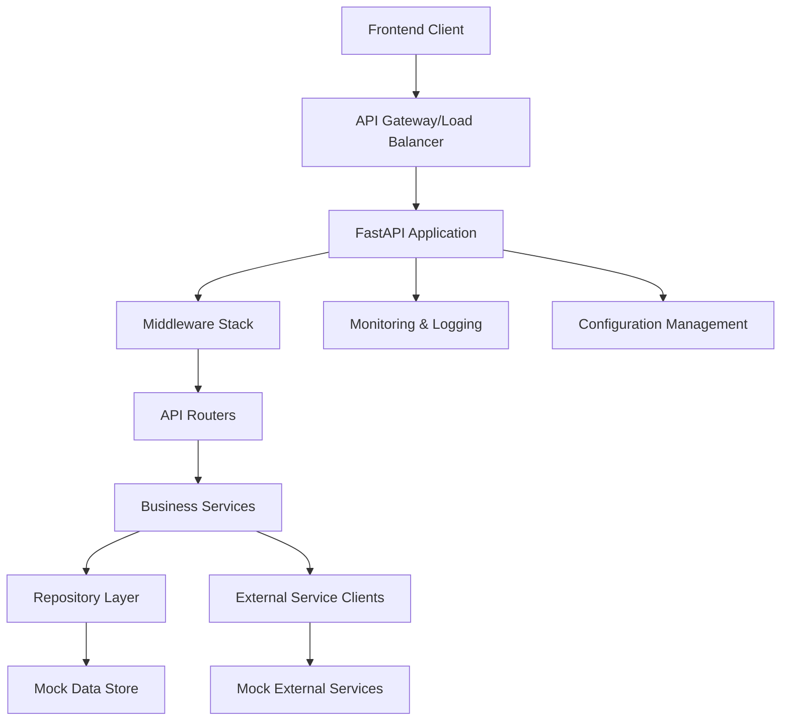

# Design Document

## Overview

The fintech FastAPI backend is designed as a microservice-oriented REST API that provides comprehensive financial services through well-structured endpoints. The architecture emphasizes separation of concerns, dependency injection, and mock external service integration to create a production-ready system that can be easily extended with real database and authentication layers.

The system follows Domain-Driven Design (DDD) principles with clear business domain boundaries, uses the Repository pattern for data abstraction, and implements comprehensive error handling and logging for observability.

## Architecture

### High-Level Architecture



### Layered Architecture

1. **Presentation Layer** - FastAPI routers and endpoint handlers
2. **Business Logic Layer** - Service classes containing domain logic
3. **Data Access Layer** - Repository pattern with mock implementations
4. **External Integration Layer** - Mock external service clients
5. **Cross-Cutting Concerns** - Middleware, logging, configuration, error handling

### Project Structure

```
fintech_backend/
├── app/
│   ├── __init__.py
│   ├── main.py                 # FastAPI application entry point
│   ├── config/
│   │   ├── __init__.py
│   │   ├── settings.py         # Application configuration
│   │   └── logging.py          # Logging configuration
│   ├── core/
│   │   ├── __init__.py
│   │   ├── dependencies.py     # Dependency injection
│   │   ├── exceptions.py       # Custom exceptions
│   │   ├── middleware.py       # Custom middleware
│   │   └── security.py         # Security utilities
│   ├── models/
│   │   ├── __init__.py
│   │   ├── base.py            # Base Pydantic models
│   │   ├── dashboard.py       # Dashboard models
│   │   ├── cards.py           # Card models
│   │   ├── accounts.py        # Account models
│   │   ├── transactions.py    # Transaction models
│   │   ├── transfers.py       # Transfer models
│   │   ├── investments.py     # Investment models
│   │   ├── savings.py         # Savings models
│   │   └── settings.py        # Settings models
│   ├── services/
│   │   ├── __init__.py
│   │   ├── dashboard_service.py
│   │   ├── card_service.py
│   │   ├── account_service.py
│   │   ├── transaction_service.py
│   │   ├── transfer_service.py
│   │   ├── investment_service.py
│   │   ├── savings_service.py
│   │   └── settings_service.py
│   ├── repositories/
│   │   ├── __init__.py
│   │   ├── base.py            # Base repository interface
│   │   └── mock_repository.py  # Mock data repository
│   ├── external/
│   │   ├── __init__.py
│   │   ├── payment_gateway.py  # Mock payment gateway
│   │   ├── bank_api.py        # Mock bank API
│   │   ├── market_data.py     # Mock market data provider
│   │   └── mobile_money.py    # Mock mobile money service
│   ├── api/
│   │   ├── __init__.py
│   │   ├── v1/
│   │   │   ├── __init__.py
│   │   │   ├── dashboard.py
│   │   │   ├── cards.py
│   │   │   ├── accounts.py
│   │   │   ├── transactions.py
│   │   │   ├── transfers.py
│   │   │   ├── send_receive.py
│   │   │   ├── investments.py
│   │   │   ├── savings.py
│   │   │   └── settings.py
│   │   └── health.py          # Health check endpoints
│   └── utils/
│       ├── __init__.py
│       ├── currency.py        # Currency conversion utilities
│       ├── calculations.py    # Financial calculations
│       ├── validators.py      # Custom validators
│       └── formatters.py      # Response formatters
├── tests/
│   ├── __init__.py
│   ├── conftest.py           # Test configuration
│   ├── unit/                 # Unit tests
│   ├── integration/          # Integration tests
│   └── api/                  # API endpoint tests
├── requirements.txt
├── requirements-dev.txt
├── .env.example
├── docker-compose.yml
└── README.md
```

## Components and Interfaces

### Core Components

#### 1. FastAPI Application (main.py)
- Application factory pattern
- Middleware registration
- Router inclusion
- Exception handler registration
- Startup/shutdown event handlers

#### 2. Configuration Management (config/settings.py)
```python
class Settings(BaseSettings):
    app_name: str = "Fintech Backend API"
    app_version: str = "1.0.0"
    debug: bool = False
    cors_origins: List[str] = ["*"]
    log_level: str = "INFO"
    
    # External service configurations
    payment_gateway_url: str = "https://mock-payment-gateway.com"
    bank_api_url: str = "https://mock-bank-api.com"
    market_data_url: str = "https://mock-market-data.com"
    
    # Rate limiting
    rate_limit_requests: int = 100
    rate_limit_window: int = 60
    
    class Config:
        env_file = ".env"
```

#### 3. Middleware Stack
- **CORS Middleware** - Cross-origin resource sharing
- **Request Logging Middleware** - Request/response logging with timing
- **Error Handling Middleware** - Global exception handling
- **Rate Limiting Middleware** - Request throttling
- **Request ID Middleware** - Unique request tracking

#### 4. Business Services
Each service encapsulates domain-specific business logic:

```python
class CardService:
    def __init__(self, repository: MockRepository, payment_gateway: PaymentGatewayClient):
        self.repository = repository
        self.payment_gateway = payment_gateway
    
    async def get_user_cards(self, user_id: str) -> List[CardResponse]:
        # Business logic for retrieving and masking card data
        
    async def freeze_card(self, card_id: str, user_id: str) -> CardResponse:
        # Business logic for card freezing with validation
```

#### 5. Repository Pattern
Abstract data access with mock implementations:

```python
class BaseRepository(ABC):
    @abstractmethod
    async def get_by_id(self, id: str) -> Optional[Dict]:
        pass
    
    @abstractmethod
    async def create(self, data: Dict) -> Dict:
        pass
    
    @abstractmethod
    async def update(self, id: str, data: Dict) -> Dict:
        pass
```

#### 6. External Service Clients
Mock implementations of external services:

```python
class PaymentGatewayClient:
    async def process_payment(self, payment_data: PaymentRequest) -> PaymentResponse:
        # Mock payment processing with realistic delays and responses
        
    async def get_exchange_rates(self, base_currency: str) -> ExchangeRateResponse:
        # Mock exchange rate data
```

## Data Models

### Core Model Structure

All models inherit from a base Pydantic model with common fields:

```python
class BaseModel(PydanticBaseModel):
    id: Optional[str] = None
    created_at: Optional[datetime] = None
    updated_at: Optional[datetime] = None
    
    class Config:
        json_encoders = {
            datetime: lambda v: v.isoformat(),
            Decimal: lambda v: str(v)
        }
```

### Domain Models

#### Financial Models
- **Account**: account_id, account_type, balance, currency, status
- **Card**: card_id, masked_number, card_type, status, limits, expiry_date
- **Transaction**: transaction_id, amount, currency, type, status, timestamp, merchant
- **Transfer**: transfer_id, from_account, to_account, amount, status, fees

#### Investment Models
- **Portfolio**: holdings, total_value, performance_metrics
- **Stock**: symbol, price, change, volume, market_cap
- **Watchlist**: user_id, symbols, alerts

#### Savings Models
- **SavingsGoal**: goal_id, target_amount, current_amount, deadline, auto_save_rules
- **SavingsAccount**: account_id, interest_rate, compound_frequency

### Request/Response Models

Separate models for API requests and responses with proper validation:

```python
class TransferRequest(BaseModel):
    from_account_id: str = Field(..., min_length=1)
    to_account_id: str = Field(..., min_length=1)
    amount: Decimal = Field(..., gt=0, decimal_places=2)
    currency: str = Field(..., regex="^[A-Z]{3}$")
    description: Optional[str] = Field(None, max_length=200)

class TransferResponse(BaseModel):
    transfer_id: str
    status: TransferStatus
    estimated_completion: datetime
    fees: Decimal
    exchange_rate: Optional[Decimal]
```

## Error Handling

### Exception Hierarchy

```python
class FintechException(Exception):
    """Base exception for fintech operations"""
    def __init__(self, message: str, error_code: str, status_code: int = 400):
        self.message = message
        self.error_code = error_code
        self.status_code = status_code

class InsufficientFundsException(FintechException):
    def __init__(self, available_balance: Decimal, requested_amount: Decimal):
        super().__init__(
            f"Insufficient funds. Available: {available_balance}, Requested: {requested_amount}",
            "INSUFFICIENT_FUNDS",
            400
        )

class CardFrozenException(FintechException):
    def __init__(self, card_id: str):
        super().__init__(
            f"Card {card_id} is frozen and cannot be used",
            "CARD_FROZEN",
            403
        )
```

### Error Response Format

```python
class ErrorResponse(BaseModel):
    status: str = "error"
    message: str
    error_code: str
    details: Optional[Dict] = None
    timestamp: datetime = Field(default_factory=datetime.utcnow)
    request_id: Optional[str] = None
```

### Global Exception Handler

```python
@app.exception_handler(FintechException)
async def fintech_exception_handler(request: Request, exc: FintechException):
    return JSONResponse(
        status_code=exc.status_code,
        content=ErrorResponse(
            message=exc.message,
            error_code=exc.error_code,
            request_id=request.state.request_id
        ).dict()
    )
```

## Testing Strategy

### Test Structure

1. **Unit Tests** - Test individual components in isolation
   - Service layer business logic
   - Utility functions
   - Model validation
   - Mock external service responses

2. **Integration Tests** - Test component interactions
   - Service + Repository integration
   - External service client integration
   - End-to-end business workflows

3. **API Tests** - Test HTTP endpoints
   - Request/response validation
   - Error handling
   - Authentication (when implemented)
   - Rate limiting

### Test Configuration

```python
# conftest.py
@pytest.fixture
def test_app():
    app = create_app(testing=True)
    return app

@pytest.fixture
def client(test_app):
    return TestClient(test_app)

@pytest.fixture
def mock_repository():
    return MockRepository()

@pytest.fixture
def card_service(mock_repository):
    payment_gateway = MockPaymentGatewayClient()
    return CardService(mock_repository, payment_gateway)
```

### Mock Data Strategy

- **Realistic Test Data** - Use realistic financial data for testing
- **Edge Cases** - Include boundary conditions and error scenarios
- **Consistent State** - Maintain data consistency across test scenarios
- **Performance Testing** - Include large datasets for performance validation

### API Testing Examples

```python
def test_get_dashboard_summary(client):
    response = client.get("/api/dashboard/summary")
    assert response.status_code == 200
    data = response.json()
    assert data["status"] == "success"
    assert "balance" in data["data"]
    assert "recent_transactions" in data["data"]

def test_transfer_insufficient_funds(client):
    transfer_data = {
        "from_account_id": "acc_123",
        "to_account_id": "acc_456",
        "amount": "10000.00",
        "currency": "USD"
    }
    response = client.post("/api/transfer/initiate", json=transfer_data)
    assert response.status_code == 400
    assert response.json()["error_code"] == "INSUFFICIENT_FUNDS"
```

## Performance and Scalability Considerations

### Caching Strategy
- **In-Memory Caching** - Cache frequently accessed data (exchange rates, market data)
- **Response Caching** - Cache expensive calculations (portfolio analytics)
- **Cache Invalidation** - Implement proper cache invalidation strategies

### Database Optimization (Future)
- **Connection Pooling** - Efficient database connection management
- **Query Optimization** - Indexed queries for financial data
- **Read Replicas** - Separate read/write operations

### Monitoring and Observability
- **Structured Logging** - JSON-formatted logs with correlation IDs
- **Metrics Collection** - Business and technical metrics
- **Health Checks** - Comprehensive health monitoring
- **Distributed Tracing** - Request tracing across services

### Security Considerations
- **Input Validation** - Comprehensive request validation
- **Rate Limiting** - Prevent abuse and ensure fair usage
- **Audit Logging** - Log all financial operations
- **Data Encryption** - Encrypt sensitive data in transit and at rest (future)

This design provides a solid foundation for a production-ready fintech backend that can be easily extended with real database integration, authentication, and additional business features.